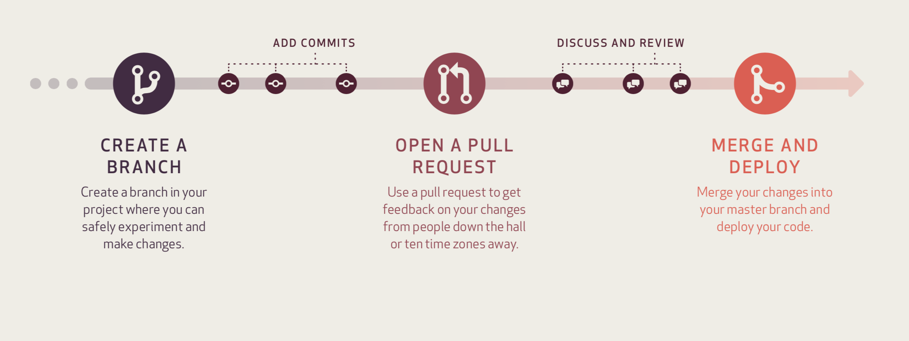

  
  
## Acknowldgements 
  
These princples were adapted from [DHSC Coding Princples](https://mattm-dhsc.github.io/coding_principles_book/) 
by Matthew Malcher, which in turn were inspired by MOJ [Coding Princples and Standards](https://moj-analytical-services.github.io/our-coding-standards/web/)

## Aim of this document

To make sharing eaiser, align pracitces and ensure we have good version control, 
these recommendations have been collated.  Essentially, good coding practice comes 
down to three parts: easily readable code, working in a autamated version controlled 
enviroment, and create clear logic.  The first two can be achieved by following the 
guidelines below.  The third requires practice and learning from mistakes.


## Script format and Structure

A new user to your code wants to quickly gain an overview and be able to run 
the code.  For this some basic context and an indication of what the user needs 
alongside the code to run it is required.  

If **using** a Metadata description file then this covers many key pieces of starting 
information such as required packages and versions, as well as details about the 
authors.  Even so, you should start each script with a small comment saying 
what it attempts to do, and a general overview of sections within the code.  

If **not using** a Metadata description then also include details about the author and 
version number or date.  Next state all source files required (e.g. "data_cars.csv") 
and any other functions or codes which are called within the code.  Now state all 
required packages by putting all library statements together here.  Finally, if there 
are any file paths or user controls then state these at the start or at least reference 
where in the code they are.  Essentially, all changeable information is included 
at the top in the easiest palce to read.

Do not write lines of code longer than 80 characters.  This is because on some 
screen settings, parts of your code will be requiring horizontal scrolling to 
see the whole code which is not only annoying but an easy source of errors.  It's 
useful to put 80 #'s at the beginning to remind yourself not to go past this.

- Comment your code stating Why not What
- Inline comments should only be used if small separate line comments would disrupt the flow of the code
- Use white space to separate activities into clear steps
- Curly braces ({}) define functions and logic statements.  To make the code clear start a new line after the first {, indent the contents, then put the closing } as the start of a new line.  Nested {} should follow the same convention but with additional indentation.
- Piping (%>%) and ggplot layer (+) should activate a new line of code

### Naming Conventions

When naming variables, functions or files, strive for names that are concise and 
meaningful (e.g. var1 is less useful than var_density).  To differentiate between 
different components in your code, you may want to use:
  
- Files: underscore_separated, all lower case: e.g. numeric_version
- Functions: prefix with func_: e.g. func_openCanOfBeans
- Variables: lowerCamelCase: e.g. addTaskCall
- If files should be run in a particular order the prefix them with numbers.
- When defining small vairables such as indices, don't use a single character.  Instead double as this makes it easier to search for in your code: e.g. ii instead of i
- Always put a space after a comma, never before, just like in regular English: e.g. x[, 1]
- Most infix operators ( == ,  + ,  - ,  <- , etc.) should always be surrounded by spaces: e.g. mean(x, na.rm = TRUE)
- Operators with high precedence don't need spaces (:, ::,  :::,  $,  @,  [, [[, ^): e.g. sqrt(x^2 + y^2)
- Do not put spaces inside or outside parentheses for regular function calls: e.g. height <- (feet * 12) + inches
- Use  " , not  ' , for quoting text. The only exception is when the text already contains double quotes and no single quotes.

Structure the sections of the code so that if possible all data is brought in at 
the beginning, then the data is manipulated, linked and transformed into the required 
final state, then the data is analysed, and finally outputs and visualisations are 
created and saved.  Separate each section clearly to help the reader know when a 
milestone has been reached.

### Example

```{css}
## Title
## Description
## Author - Date
################################################################################
startTime <- Sys.time() # For timing the speed of the whole code (see end)

# Where the data is
path <- "C:/some_directory/some_sub_directory/"
funcFile <- "some_functions.R"
dataFile <- "data.csv"
source(paste0(path,funcFile)) # Tells R where to look for separated functions

# Required packages
list.of.packages <- c("tseries","forecast","dplyr","ggplot2")
new.packages <- list.of.packages[!(list.of.packages %in% installed.packages()[,"Package"])]
if(length(new.packages)) install.packages(new.packages)
suppressPackageStartupMessages(library("tseries")) 
suppressPackageStartupMessages(library("forecast"))
suppressPackageStartupMessages(library("dplyr")) 
suppressPackageStartupMessages(library("ggplot2")) 

################################################################################
## Bring data in
################################################################################
rawData <- read.csv(file = paste0(path, dataFile),header = T)
# rawData contains X variables and Y observations taking 5GB memory

################################################################################
## Transform data
################################################################################
sales <- rawData %>%
  filter(quality == "1") %>% 
  group_by(Region) %>% 
  summarize_if(is.numeric, mean) %>% 
  ungroup() %>%
  gather(measure, value, -number) %>%
  arragnge(date)

################################################################################
## Analyse data
################################################################################
sales$output <- (sales$number * 12) + sqrt(sales$price^2 + sales$quantity^2)

################################################################################
## Visualize data
################################################################################
ggplot(sales,aes(x= date, y = price, color = output)) + 
  geom_point() + 
  labs(x = "dates", y = "Price",title = "Some sales chart")

# Output Run time as statement
cat("\n", "Done, Run time:", format(Sys.time() - start_time, digits = 4), "\n") 
```


## Version Control

To ensure changes are well documented, errors are easier to trace, and 
work is not lost or overwritten, use version control.  The standard approach 
to do this from RStudio is to separate each piece of work into individual 
projects and use "Git".  

### Project Structure

If using RStudio, then a new project can be created from the dropdown menus.
Regardless, a project is essentially a collection of folders which have in-built
links.  This means that code can be spread across the folders so that it can 
be organised whilst at the same time the code knows where all the components are.
Usually, a project consits of:

- Metadata (title, description, version, authors, license, packages with 
versions required) saved in a **DESCRIPTION** file
- functions in separate .R scripts saved in the **R/** folder
- tests in a **tests/** folder (optional-mainly for package development)
- Documentation saved as .rmd files in the **vignettes/** folder

### here()

If your code is saved as a project then it is a very good idea to use the *here()*
package instead of setwd() commands.  This automatically takes information about
where the project folder is stored and updates when the folder is moved.  This 
means that here() commands will work on other file systems whereas setwd() 
commands need to be updated every time the code is moved or the folder structure
changes.

### Git

Git can track a folder (aka repo) so that changes are identified and 
commented.  This then builds a log which can be used to restore older 
versions if necessary.  These repos can be held in your file store or on 
a hosting site such as GitHub.  RStudio can be setup to interact with Git 
and GitHub in order to make this process part of the normal way of working.

A repository is Git's encompassing of the entire collection of files and 
folders associated with a project, along with each file's revision history. 
The file history appears as snapshots in time called **commits** (versions), 
these commits can be organized into multiple lines of development called 
**branches** (seperate areas of development on the same project). Using 
the command line or other ease-of-use interfaces, a Git repository also 
allows for: interaction with the history, **cloning** (copying), creating 
branches, committing (saving a version), **merging** (bringing two versions 
together), comparing changes across versions of code, and more. 




### usethis()
Git is primarliy controlled through the terminal using git commands.  The 
usethis package allows these commands to be run through the R console.  A 
GUI can be added to RStudio for Git by going to *Tool > Project Options > Git/SVN*.  
Connections can then be made to GitHub by setting a Personal Authorisation 
Token (*browse_github_pat()*) and creating a repo in GitHub (*use_github(protocl = "https")*)

### test data

When sharing code it is very useful if the actual data can't be provided, to provide 
some test data along with the code.  This does not need to be interesting data but 
purely for the user to be able to run the code through in full.  This helps as it's 
easier to understand what a code is trying to do when you are not worrying about data 
formats or erronous values within the raw data.  It will also help highlight if 
package versions are incorrect or whether the code has been downloaded/cloned with errors.

